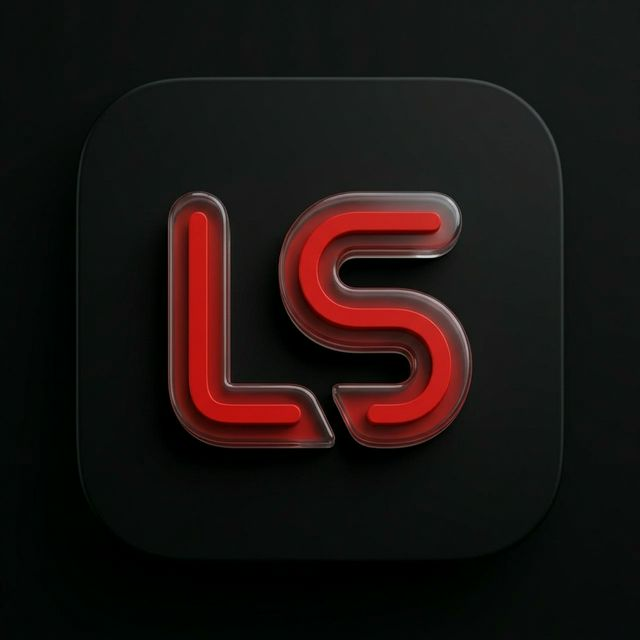

# 🎬 LocalStream

<p align="center">
  
</p>

<p align="center">
  <strong>Votre médiathèque personnelle, style Netflix — sur téléphone Android.</strong>
</p>

<p align="center">
  
  
  
  
  
  
</p>

---

**LocalStream** est une application de streaming multimédia locale moderne, conçue pour transformer vos dossiers de vidéos (films et séries) en une bibliothèque interactive inspirée des plus grandes plateformes de streaming. Elle fonctionne **sans serveur** : tout tourne directement sur votre téléphone Android.

---

## ✨ Fonctionnalités

### 📱 Interface & Expérience Utilisateur
- **Design Glassmorphism** : interface sombre, translucide et premium avec effets de transparence
- **Fullscreen adaptatif** : prise en charge des encoches et safe areas Android (status bar, navigation bar)
- **Header intelligent** : disparaît en dessous d'un seuil de scroll, fondu transparent au-dessus
- **Vue Hero cinématique** : grande bannière avec backdrop, titre, genres, date de sortie, synopsis cliquable

### 📂 Scan & Détection Automatique (Android)
- **Scan multi-dossiers** : analyse automatique de `Movies`, `Download`, `Downloads`, et `Documents`
- **Détection de séries** : reconnaissance des patterns `S01E01`, `1x01`, `SeriesName - S01 E01`
- **Regroupement en saisons** : les épisodes sont organisés par saison/épisode dans une vue dédiée
- **Filtrage des vidéos personnelles** : exclusion automatique des vidéos de caméra (DCIM, WhatsApp, GoPro, DJI, etc.) avec possibilité de les réintégrer manuellement (whitelist)
- **Sous-titres auto-détectés** : recherche automatique de fichiers `.srt`/`.vtt` voisins du fichier vidéo

### 🎬 Sagas & Collections TMDB
- **Regroupement automatique des films en sagas** : les films appartenant à la même collection TMDB (ex : Harry Potter, The Dark Knight) sont automatiquement regroupés en une saga
- **Affiche et synopsis de la collection** récupérés depuis TMDB

### 🖼️ Métadonnées TMDB
- Récupération automatique des **affiches officielles**, **arrière-plans (backdrop)**, **descriptions**, **genres** et **dates de sortie**
- Pour les séries : récupération des **titres, descriptions et visuels** de chaque épisode par saison
- Persistance des métadonnées en cache local (localStorage) pour un chargement instantané

### 💬 Sous-titres
- **OpenSubtitles** : connexion via API Key, Username et Password pour chercher et télécharger des sous-titres en français ou anglais
- **Sous-titres locaux (Web)** : import manuel de fichiers `.srt` ou `.vtt` depuis le navigateur
- **Sous-titres natifs (Android)** : sélection d'un fichier de sous-titre depuis le stockage Android via le plugin natif, transmis directement au lecteur externe
- **Conversion SRT → VTT** automatique pour le lecteur interne

### ▶️ Lecture Vidéo
- **Lecteur interne** : lecteur HTML5 avec contrôles tactiles (double-tap ±10s, tap pour pause, barre de progression)
- **Lecteur externe (Android)** : ouverture dans n'importe quel lecteur installé (VLC, MX Player, etc.) avec liste des lecteurs disponibles
- **Reprise automatique** : sauvegarde de la position de lecture, reprise exacte à la seconde près
- **Barre de progression** sur chaque vignette (% avancement)
- **Réinitialisation de la progression** d'un film

### 📋 "Continue à regarder"
- Section dédiée en haut de l'accueil avec les vidéos en cours
- Affichage de l'avancement en pourcentage
- Pour les séries : ouverture automatique sur le **dernier épisode non terminé**

### ✅ Suivi "Vu / Non vu"
- Marquage manuel d'un film ou d'une série comme **visionné** (icône ✓ verte)
- Propagation automatique : si tous les épisodes d'une série sont vus, la série entière est marquée comme vue
- Les contenus vus sont **atténués visuellement** (opacité réduite + désaturation) et **placés en fin de liste**

### 🔍 Recherche & Filtres
- **Recherche textuelle** en temps réel par titre
- **Tri** : alphabétique, par date, par taille, par durée
- **Filtre par genre** TMDB (Action, Horreur, Comédie, etc.)
- **Filtre par résolution** : 4K, 1080p, 720p, SD

### 📋 Playlists Personnalisées
- Création et gestion de **playlists** personnalisées
- Ajout de n'importe quel film ou épisode à une playlist
- Vue dédiée avec l'onglet **"Mes Listes"**

### ⚙️ Paramètres
- Configuration des clés API (TMDB, OpenSubtitles)
- Sélection du lecteur externe préféré parmi ceux installés sur l'appareil
- Bouton de rechargement des métadonnées depuis TMDB

---

## 🚀 Installation & Lancement

### Prérequis
- [Node.js](https://nodejs.org/) (v18+)
- [Android Studio](https://developer.android.com/studio) (pour la version APK)

### Installation
```bash
git clone https://github.com/DZTic/localstream.git
cd localstream
npm install
```

### Lancer en version Web (navigateur)
```bash
npm run dev
```
> Ouvre http://localhost:3000 — fonctionne en mode "sélection de fichiers" depuis le navigateur.

### Compiler l'APK Android
```bash
# 1. Construire le bundle web
npm run build

# 2. Synchroniser avec Capacitor
npx cap sync android

# 3. Ouvrir dans Android Studio
npx cap open android
```
Dans Android Studio : `Build > Build Bundle(s) / APK(s) > Build APK(s)`

---

## ⚙️ Configuration des APIs

Dans l'onglet **Paramètres** ⚙️ de l'application :

| Clé | Description |
|---|---|
| **TMDB API Key** | Pour récupérer les affiches, descriptions, genres, épisodes. Gratuit sur [themoviedb.org](https://www.themoviedb.org/settings/api) |
| **OpenSubtitles API Key** | Pour la recherche de sous-titres. Compte sur [opensubtitles.com](https://www.opensubtitles.com) |
| **OpenSubtitles Username** | Nom d'utilisateur OpenSubtitles |
| **OpenSubtitles Password** | Mot de passe OpenSubtitles |

---

## 🛠️ Stack Technique

| Technologie | Rôle |
|---|---|
| [React 19](https://react.dev/) | Interface utilisateur |
| [Vite 6](https://vitejs.dev/) | Bundler & dev server |
| [TypeScript 5.8](https://www.typescriptlang.org/) | Typage statique |
| [Capacitor 8](https://capacitorjs.com/) | Bridge web ↔ natif Android |
| [TailwindCSS 4](https://tailwindcss.com/) | Styles utilitaires |
| [Lucide React](https://lucide.dev/) | Icônes |
| [TMDB API](https://www.themoviedb.org/documentation/api) | Métadonnées films & séries |
| [OpenSubtitles API](https://www.opensubtitles.com/) | Sous-titres multilingues |

---

## 📁 Structure du Projet

```
localstream/
├── src/
│   ├── App.tsx          # Composant principal (logique & UI complète)
│   ├── main.tsx         # Point d'entrée React
│   └── index.css        # Styles globaux
├── public/
│   └── logo.png         # Logo de l'application
├── android/             # Projet Android (Capacitor)
│   └── app/src/main/java/com/localstream/app/
│       ├── MainActivity.java      # Activité principale Capacitor
│       ├── PlayerActivity.java   # Lecteur vidéo natif Android
│       └── VideoLauncherPlugin.java
├── index.html           # Point d'entrée HTML
├── capacitor.config.ts  # Configuration Capacitor
├── vite.config.ts       # Configuration Vite
└── package.json
```

---

## 📄 Licence

Distribué sous la licence **MIT**. Voir [LICENSE](LICENSE) pour plus d'informations.

---

<p align="center">Made with ❤️ — <em>Regardez vos fichiers locaux comme sur Netflix.</em></p>
